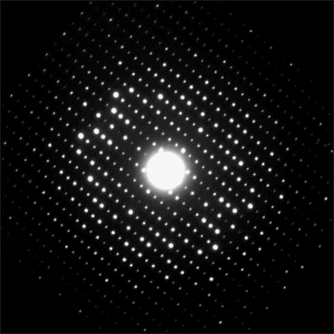
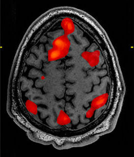
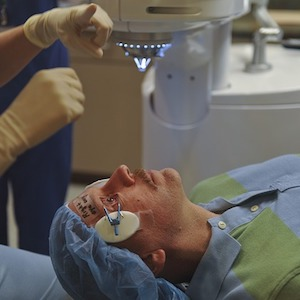

## Automatic photo gallery summarisation using machine learning
{:.float-left}

One of the challenges in today where cameras are
readily available is that the amount of photos taken
is phenomenal. The gallery summarisation algorithms
summarise the photographs based on various low-level image features such as colour, texture, tone, as well as high-level features such as object
recognition and scene understanding.

## Automatic tracking of X-ray diffraction pattern
{:.float-left}

Analysis of X-ray diffraction pattern is a very useful method in Crystallography. However, in order
to analyse the pattern accurately, the location of
each diffracted beam must be tracked.
This project developed a novel beam tracking
methods based on object tracking algorithms which can cope with the challenges of beam distortion and occlusion in real applications.

This project has finished in 2017.

## Evaluation of Sensing and Computer Vision Techniques for Recycling Industry
{:.float-left}

Recycling industry is one of the most challenging applications for
computer vision techniques. Unlike other popular applications such as face
recognition, the environment of the recycling plant and the characteristic
of the recyclable objects are extremely hard to define. This project addressed
a set of particular vital challenges for the current recycling technologies.

This project has finished in 2016.

## Compressed Sensing for Functional Magnetic Resonance Imaging (fMRI)
{:.float-left}

Functional Magnetic Resonance Imaging is a popular non-invasive tool for the
study of brain activity. By incorporating the compressed sensing, a novel signal
processing technique, the performance of the fMRI can be vastly improved.
This was a PhD project which had been conducted between 2011--2016.

The thesis of this project is publicly available on [White Rose eTheses Online](http://etheses.whiterose.ac.uk/15704/).

This project has finished in 2016.

## Automatic Eye Tracking for Eye Surgery Microscope
{:.float-left}

Manual microscope control has always been inconvenient whenever an
ophthalmologist has to perform the eye surgery. This project proposes a novel
eye tracking technique designed especially for incorporating into the autonomous
microscope, providing the ability to track and follow the movement of the
subject’s eye without the input of the ophthalmologist.

This project has finished in 2010.

# Selected publications

- W. Hotrakool, C. Abhayaratne, [**&ldquo;Towards Baseline-independent Analysis of Compressive Sensed Functional Magnetic Resonance Image Data&rdquo;**](), *Proceedings of 2017 22nd Digital Signal Processing conference (DSP2017), 2017*.

- W. Hotrakool, C. Abhayaratne [**&ldquo;An Optimal Learning Parameter for Running Gaussian-based Referenced Compressive Sensing&rdquo;**](), *Proceedings of 2nd IET International Conference on Intelligent Signal Processing 2015 (ISP2015), 2015*.

- W. Hotrakool, C. Abhayaratne [**&ldquo;Efficient Reconstruction of Functional Magnetic Resonance Imaging (fMRI) Data From Compressive Measurements Based On Correlated Reference&rdquo;**](), *Proceedings of 10th IMA International Conference on Mathematics in Signal Processing, 2014*.

- W. Hotrakool, C. Abhayaratne [**&ldquo;Running Gaussian reference-based reconstruction for video compressed sensing&rdquo;**](), *Proceedings of 2014 IEEE International Conference on Acoustics, Speech and Signal Processing (ICASSP), 2014*.

- W. Hotrakool, C. Abhayaratne [**&ldquo;Fast Compressed Sensing Reconstruction Using The Least Squares and Signal Correlation&rdquo;**](), *Proceedings of IET Intelligent Signal Processing Conference 2013 (ISP 2013), 2013*.

- W.Hotrakool, P. Siritanawan, T. Kondo [**&ldquo;A Real-time Eye-tracking Method Using Time-varying Gradient Orientation Patterns&rdquo;**](), *Proceedings of the 2010 International Conference on Electrical Engineering/Electronics Computer Telecommunications and Information Technology (ECTI-CON), 2010*.

- W. Hotrakool, P. Siritanawan, T. Kondo [**&ldquo;Real-time Gradient Orientation Pattern Matching&rdquo;**](), *Proceedings of the International Conference on Embedded System and information Technology (ICESIT) 2010, 2010*.
